Practica02-Mi-sitioWeb-css-
===========================

-   Diseño de página con tres columnas

    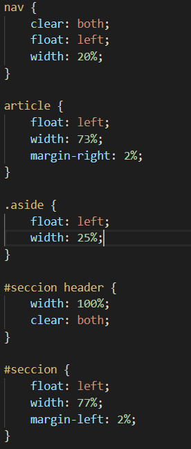

    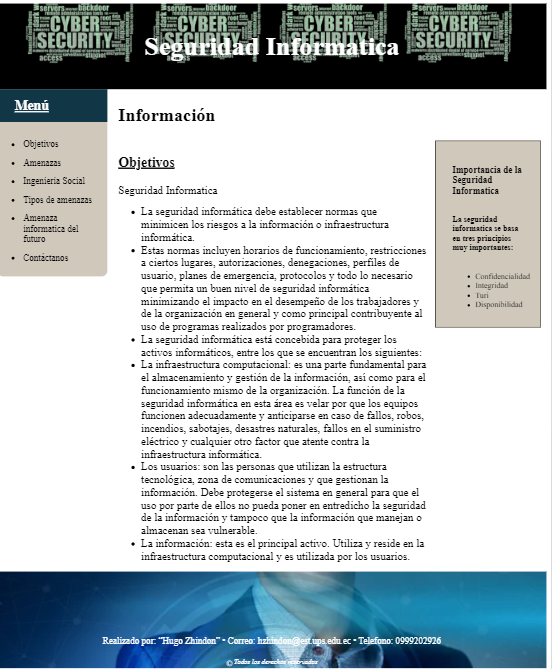

-   Diseño de pagina con dos columnas

    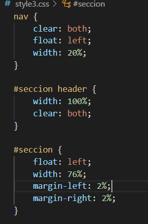

    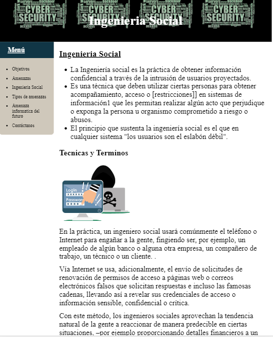

-   Selectores

    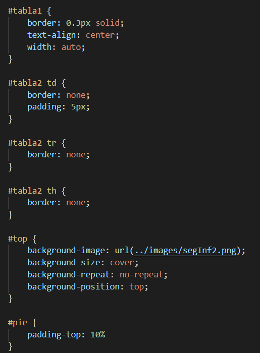

-   Personalizar al menos seis etiquetas

    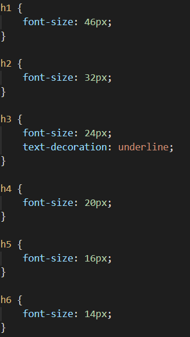

-   Personalice todos los hipervínculos usando pseudo-clases.

    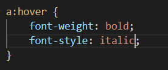

-   Menú vertical (navegación) para todas las páginas. El menú debe tener bordes
    ovalados, con color de fondo y una separación entre cada menú de al menos
    5px.

    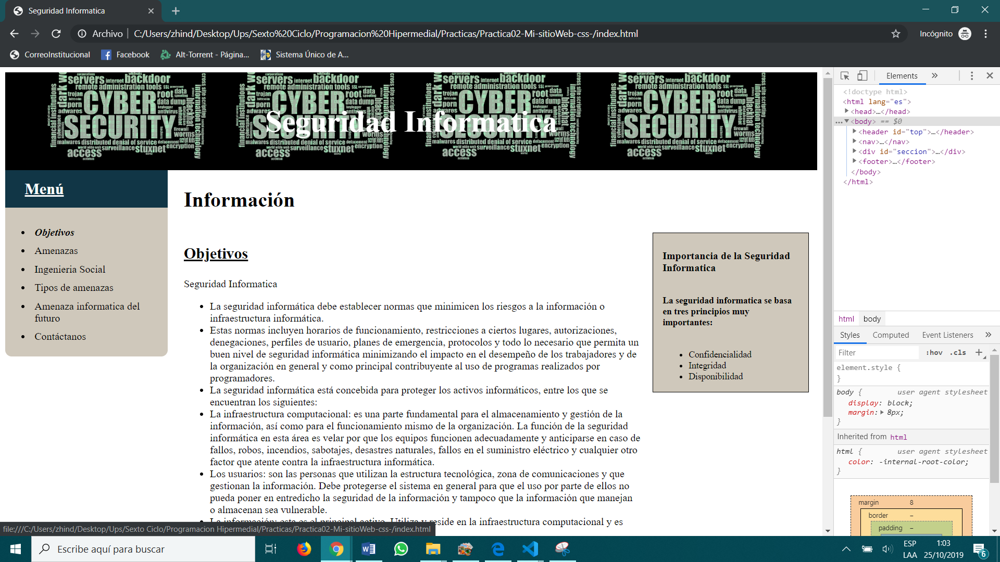

-   Se pide crear una nueva página HTML, en donde, se muestre un formulario de
    contacto que tenga los siguientes campos (nombre, correo electrónico,
    mensaje y botón para enviar).

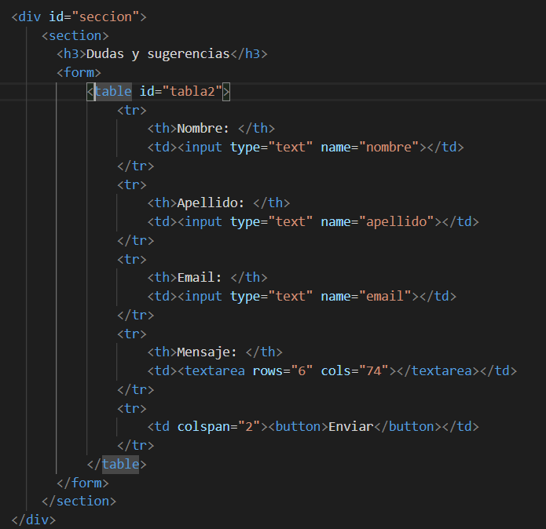

-   Validación de las paginas html en W3C

-   Index.html

    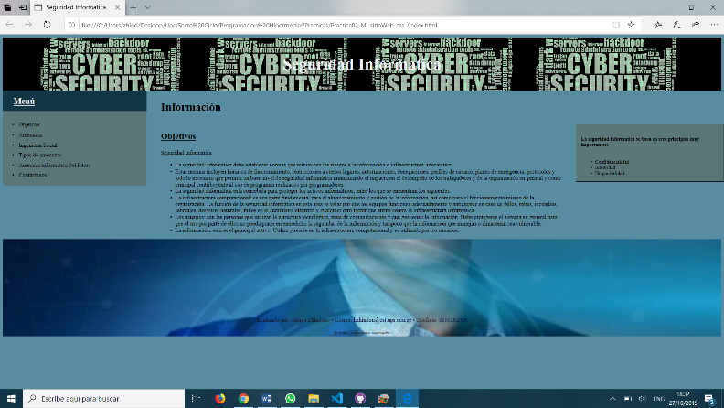

    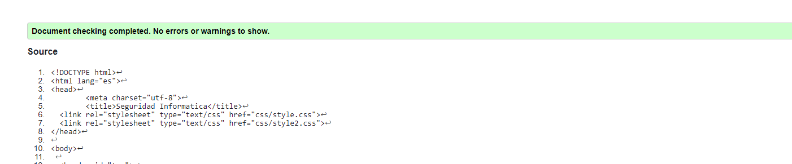

-   Amenazas.html

    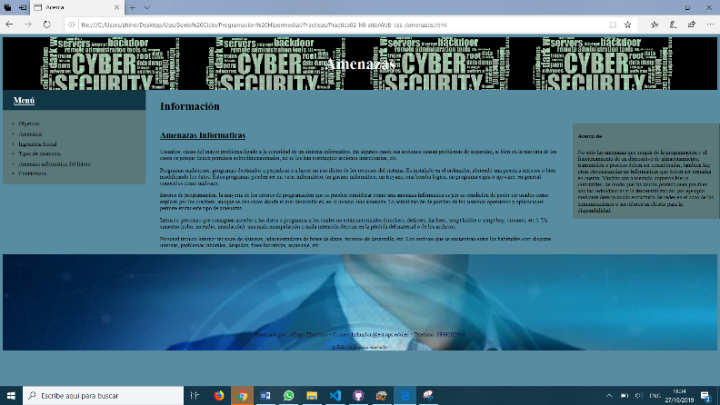

    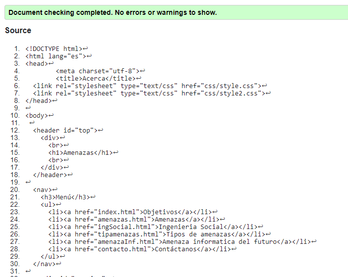

-   IngSocial.hmtl

    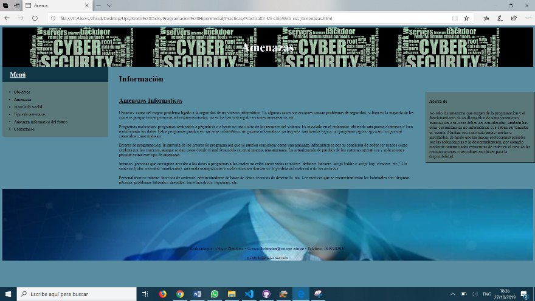

    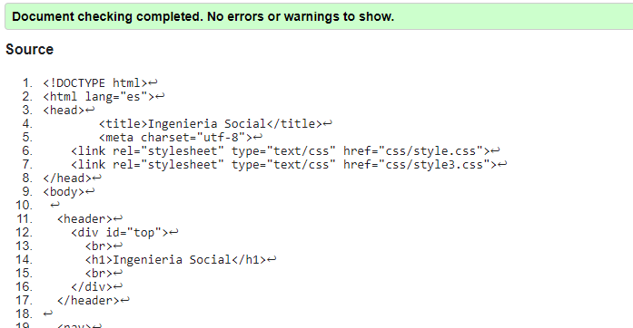

-   Tiposdeamenazas.html

    

    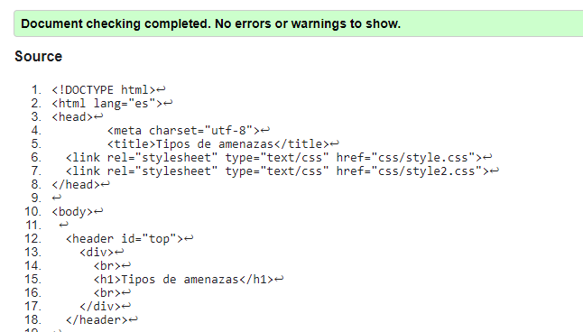

-   AmenazaInf.html

    

    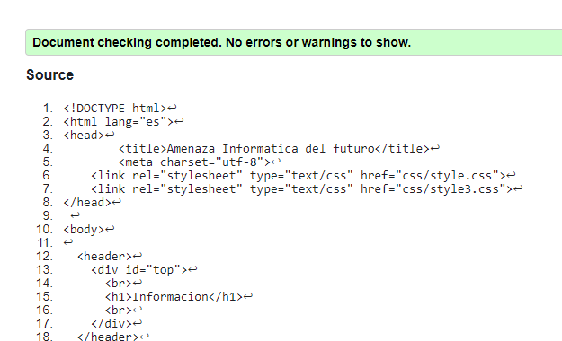

-   Contacto.html

    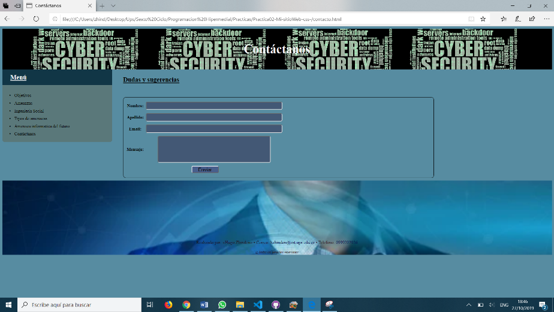

    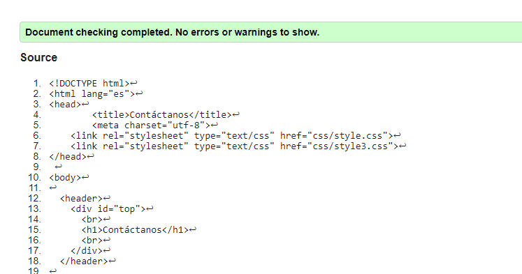

-   Validación archivos css

-   Style.css

    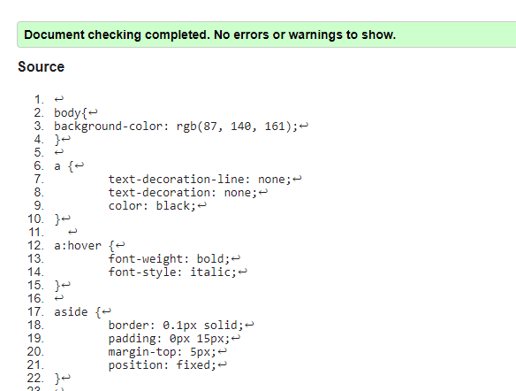

-   Style2.css

    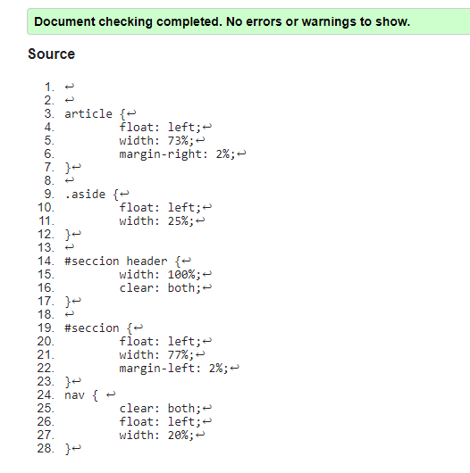

-   Style3.css

    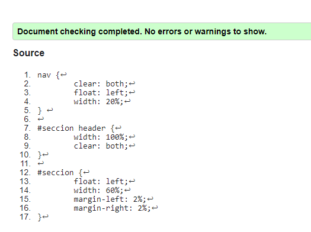

| **CONCLUSIONES**: Para poder tener una estructura se deben manejar archivos css, hasta por mayor facilidad de modificación de las páginas web, ya que como podemos apreciar dentro de la practica tenemos paginas con dos y tres columnas, pero su estructura es mucho más fácil realizar mediante los archivos de estilo o los css                                                                                                                                                                                                                                 |
|---------------------------------------------------------------------------------------------------------------------------------------------------------------------------------------------------------------------------------------------------------------------------------------------------------------------------------------------------------------------------------------------------------------------------------------------------------------------------------------------------------------------------------------------------------------------|
| **RECOMENDACIONES**: Se debe manejar una estructura ordenada de las etiquetas dentro de los archivos html, ya que al no ser así se pueden generar ciertos errores por las etiquetas al momento de validar las paginas, y en cuanto a los archivos css, debemos mantener un orden para cada uno de los estilos que estamos aplicando es decir, tood lo que tiene que ver con el formato del texto en una parte y lo que tiene que ver con la estructura de la página en otro archivo css ya que de esta manera se puede llevar una mejor administración de la pagina |
